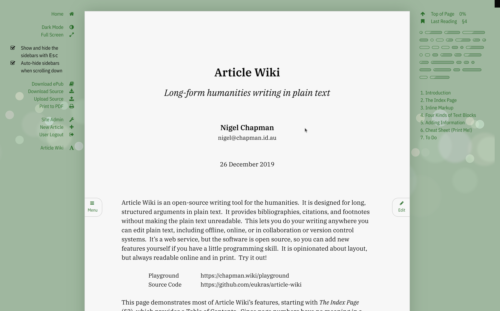

# Article Wiki

## Long-form humanities writing in plain text.

Article Wiki is a web app for writing long, structured articles using wiki
markup. It lets you work in plain text on any device, with footnotes,
bibliographies, and indexes that don't clutter up your text.

* Author: Nigel Chapman, nigel@chapman.id.au.
* Technologies: Python, Redis.
* Version: v.0.2.1 (beta, single user only)
* License: GPL v.3; see [LICENSE.txt](LICENSE.txt).


## Getting Started 

* Running my website: https://chapman.wiki
* A help page and demo of all wiki features: https://chapman.wiki/read/eukras/help


## Screenshots




* Images are of v.2.1
* See also the 'Theme' button in the footer for low-light reading or editing.


## Prerequisites, Installation, Tests, Deployment

* See [INSTALL.md](INSTALL.md) to get up and running.


## Languages

```
github.com/AlDanial/cloc v 1.96  T=0.14 s (966.8 files/s, 123776.0 lines/s)
-------------------------------------------------------------------------------
Language                     files          blank        comment           code
-------------------------------------------------------------------------------
Python                          77           2055           3175           6199
SCSS                            15            365            151           1888
JavaScript                      10            116            154            900
Text                             3            121              0            585
HTML                            16            149              5            460
JSON                             2              0              0            413
Markdown                         5             54              0            108
make                             2             15              1             46
YAML                             1              3             26             18
INI                              1              0              0             10
Dockerfile                       1              5              0              6
-------------------------------------------------------------------------------
SUM:                           133           2883           3512          10633
-------------------------------------------------------------------------------
```

Stats are from v.0.2.1.


## Contributing

Questions about using or adapting the software are welcome.  Bug reports can be
filed on GitHub. If you add anything interesting, point me to a demo, or submit
a pull request. 
